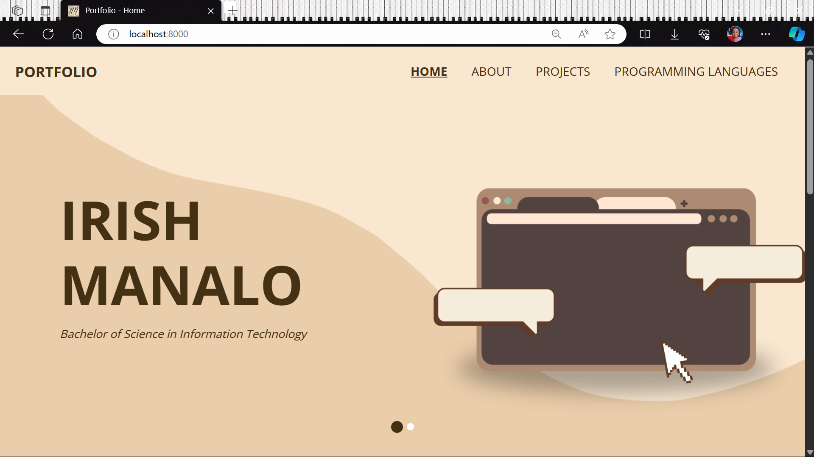

# 💻 Portfolio Website 👩🏻

<i> This project is a personal portfolio website showcasing the skills, hobbies, projects, and programming languages proficiency of me. It consists of several routes: </i>
 
- Landing Page: The main landing page introduces visitors to the website.  
- About Me Section: This section provides insights into my hobbies and skills.  
- Projects: Displays a collection of my projects with descriptions.  
- Programming Languages: Highlights the programming languages and technologies I am proficient with. 

<i> The website incorporates images and CSS styling to enhance the visual appeal and user experience. </i>

<b> 🌟 Features: </b>
- Responsive design for compatibility across various devices.
- Easy navigation with clearly defined routes.
- Visual elements such as images to engage visitors.
- CSS styling for aesthetics and presentation.

<b> ⚙️ Technologies Used: </b>
- HTML5
- CSS3
- Bootstrap (used for template then redesigned)
- JavaScript
- Django
- Git for version control

  © Irish Manalo 2024
